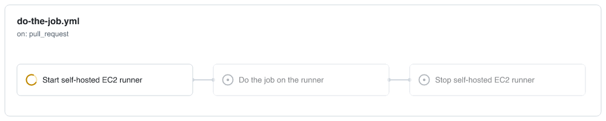

# On-demand self-hosted AWS EC2 runner for GitHub Actions

[](https://github.com/jonico/awesome-runners)

Start your EC2 [self-hosted runner](https://docs.github.com/en/free-pro-team@latest/actions/hosting-your-own-runners) right before you need it.
Run the job on it.
Finally, stop it when you finish.
And all this automatically as a part of your GitHub Actions workflow.

> [!IMPORTANT]
> **Supported operating systems: yum-based Linux only.**
>
> The bootstrap script that this action injects as EC2 `user-data` is hardcoded to use `yum`, `useradd`, `sudo`, `bash`, and a `tmpfs` `/tmp`. That means the AMI you pass via `ec2-image-id` **must** be a yum-based distribution — Amazon Linux 2023 (the tested baseline), Amazon Linux 2, or a RHEL-family image (RHEL / CentOS Stream / Rocky / Alma) whose `/tmp` is mounted as tmpfs.
>
> **Debian, Ubuntu, Alpine, and any other non-yum distributions are not supported.** If you launch this action against such an AMI, the EC2 instance will boot but the runner bootstrap will fail. The action now surfaces this quickly: it fails fast naming the failing step and prints the instance's console output (see [Troubleshooting a failed start](#troubleshooting-a-failed-start)). Cross-distro support is not on the roadmap — if you need it, fork and replace the `userData` bootstrap in `src/aws.js`.



See [below](#example) the YAML code of the depicted workflow. <br><br>

**Table of Contents**

- [Use cases](#use-cases)
  - [Access private resources in your VPC](#access-private-resources-in-your-vpc)
  - [Customize hardware configuration](#customize-hardware-configuration)
  - [Save costs](#save-costs)
- [Usage](#usage)
  - [How to start](#how-to-start)
  - [Inputs](#inputs)
  - [Environment variables](#environment-variables)
  - [Outputs](#outputs)
  - [Example](#example)
  - [Real user examples](#real-user-examples)
- [Self-hosted runner security with public repositories](#self-hosted-runner-security-with-public-repositories)
- [License Summary](#license-summary)

## Use cases

### Access private resources in your VPC

The action can start the EC2 runner in any subnet of your VPC that you need - public or private.
In this way, you can easily access any private resources in your VPC from your GitHub Actions workflow.

For example, you can access your database in the private subnet to run the database migration.

### Customize hardware configuration

GitHub provides one fixed hardware configuration for their Linux virtual machines: 2-core CPU, 7 GB of RAM, 14 GB of SSD disk space.

Some of your CI workloads may require more powerful hardware than GitHub-hosted runners provide.
In the action, you can configure any EC2 instance type for your runner that AWS provides.

For example, you may run a c5.4xlarge EC2 runner for some of your compute-intensive workloads.
Or r5.xlarge EC2 runner for workloads that process large data sets in memory.

### Save costs

If your CI workloads don't need the power of the GitHub-hosted runners and the execution takes more than a couple of minutes,
you can consider running it on a cheaper and less powerful instance from AWS.

According to [GitHub's documentation](https://docs.github.com/en/free-pro-team@latest/actions/hosting-your-own-runners/about-self-hosted-runners), you don't need to pay for the jobs handled by the self-hosted runners:

> Self-hosted runners are free to use with GitHub Actions, but you are responsible for the cost of maintaining your runner machines.

So you will be charged by GitHub only for the time the self-hosted runner start and stop.
EC2 self-hosted runner will handle everything else so that you will pay for it to AWS, which can be less expensive than the price for the GitHub-hosted runner.

## Usage

### How to start

Use the following steps to prepare your workflow for running on your EC2 self-hosted runner:

**1. Configure AWS credentials (OIDC preferred)**

This action reads AWS credentials from the environment. Two paths — pick one.

**Option A (preferred): GitHub OIDC.** No long-lived static keys in your GitHub secrets. A short-lived STS token is minted per workflow run, scoped to the exact repo / branch / environment.

1. Create an OIDC provider for GitHub in your AWS account (one-time per account). The thumbprint is `6938fd4d98bab03faadb97b34396831e3780aea1` as of this writing.
2. Create an IAM role with a trust relationship to `token.actions.githubusercontent.com`:

   ```hcl
   # Terraform
   resource "aws_iam_role" "github_runner" {
     name = "github-runner"
     assume_role_policy = jsonencode({
       Version = "2012-10-17"
       Statement = [{
         Effect = "Allow"
         Principal = { Federated = "arn:aws:iam::<account>:oidc-provider/token.actions.githubusercontent.com" }
         Action   = "sts:AssumeRoleWithWebIdentity"
         Condition = {
           StringEquals = {
             "token.actions.githubusercontent.com:aud" = "sts.amazonaws.com"
           }
           StringLike = {
             "token.actions.githubusercontent.com:sub" = "repo:<org>/<repo>:*"
           }
         }
       }]
     })
   }
   ```

3. Attach the least-privilege permissions policy below to that role.
4. In the workflow, grant OIDC permission to the job and assume the role via `aws-actions/configure-aws-credentials` without any access-key secrets:

   ```yaml
   permissions:
     id-token: write   # required for OIDC
     contents: read
   steps:
     - uses: aws-actions/configure-aws-credentials@<sha>
       with:
         role-to-assume: arn:aws:iam::<account>:role/github-runner
         aws-region: <region>
     - uses: namecheap/ec2-github-runner@<sha>
       with:
         mode: start
         # ...
   ```

**Option B (legacy): static IAM access keys.** Only use this if OIDC isn't available (e.g., restricted AWS Organization SCPs). The keys rotate manually and live in GitHub secrets indefinitely — a permanent attack surface.

1. Create an IAM user with the same permissions policy below.
2. Generate an access key pair for the user; store as `AWS_ACCESS_KEY_ID` / `AWS_SECRET_ACCESS_KEY` secrets.
3. Use `aws-actions/configure-aws-credentials` with those secrets.

**Permissions policy (both paths)**

1. Attach the following least-privilege minimum required permissions to the role (Option A) or user (Option B):

   ```
   {
     "Version": "2012-10-17",
     "Statement": [
       {
         "Effect": "Allow",
         "Action": [
           "ec2:RunInstances",
           "ec2:TerminateInstances",
           "ec2:DescribeInstances",
           "ec2:DescribeInstanceStatus",
           "ec2:DescribeImages",
           "ec2:DescribeTags",
           "ec2:GetConsoleOutput"
         ],
         "Resource": "*"
       }
     ]
   }
   ```

   `ec2:DescribeTags` and `ec2:GetConsoleOutput` power the [bootstrap diagnostics](#troubleshooting-a-failed-start): the action reads the instance's bootstrap phone-home tag to fail fast on cloud-init errors, and captures the serial-console output when a start fails. `ec2:TerminateInstances` also covers the default cleanup of a failed start (see `cleanup-on-start-failure`).

   **Bootstrap phone-home (optional, recommended).** For the instance to tag its own bootstrap progress — which lets the action fail fast and name the failing step instead of waiting out the full registration timeout — the IAM role attached to the runner via `iam-role-name` needs permission to tag itself:

   ```
   {
    "Version": "2012-10-17",
    "Statement": [
      {
        "Effect": "Allow",
        "Action": "ec2:CreateTags",
        "Resource": "arn:aws:ec2:*:<account>:instance/*",
        "Condition": {
          "StringEquals": {
            "aws:ARN": "${ec2:SourceInstanceARN}"
          }
        }
      }
    ]
   }
   ```

   The condition scopes the permission so an instance can tag only itself. This is best-effort: if you don't set `iam-role-name`, or omit this permission, phone-home tagging is skipped and the action falls back to registration-timeout detection with no error.

   If you plan to attach an IAM role to the EC2 runner with the `iam-role-name` parameter, you will need to allow additional permissions:

   ```
   {
    "Version": "2012-10-17",
    "Statement": [
      {
        "Effect": "Allow",
        "Action": [
          "ec2:ReplaceIamInstanceProfileAssociation",
          "ec2:AssociateIamInstanceProfile"
        ],
        "Resource": "*"
      },
      {
        "Effect": "Allow",
        "Action": "iam:PassRole",
        "Resource": "*"
      }
    ]
   }
   ```

   The action always tags every instance it launches — with its own signature tags (`ec2-github-runner:managed`, `:repository`, `:label`, `:started-at`, which the [cleanup reaper](#reaping-orphaned-runners-mode-cleanup) relies on) plus any `aws-resource-tags` you supply — so `ec2:CreateTags` at launch time is required:

   ```
   {
    "Version": "2012-10-17",
    "Statement": [
      {
        "Effect": "Allow",
        "Action": [
          "ec2:CreateTags"
        ],
        "Resource": "*",
        "Condition": {
          "StringEquals": {
            "ec2:CreateAction": "RunInstances"
          }
        }
      }
    ]
   }
   ```

   The base policy already grants `ec2:DescribeInstances` and `ec2:TerminateInstances`, which are all the `cleanup` reaper needs on the AWS side (it deregisters runners through the `github-token`). You can scope `TerminateInstances` to tagged instances with a `Condition` on `aws:ResourceTag/ec2-github-runner:managed` for defense in depth.

   These example policies above are provided as a guide. They can and most likely should be limited even more by specifying the resources you use.

2. Add the keys to GitHub secrets.
3. Use the [aws-actions/configure-aws-credentials](https://github.com/aws-actions/configure-aws-credentials) action to set up the keys as environment variables.

**2. Prepare the GitHub token**

The action's `github-token` input needs permission to manage self-hosted runners on the target repo — specifically it hits `POST /repos/:owner/:repo/actions/runners/registration-token` and `DELETE /repos/:owner/:repo/actions/runners/:id`. Three token types work; pick the lowest-privilege one your setup supports.

**Option A (preferred): GitHub App installation token.** No human identity, no long-lived secret.

1. Create a GitHub App in your org with the permissions below. Grant it installation on the target repo.
2. In the workflow, mint a short-lived installation token via `actions/create-github-app-token@<sha>` and pass its output to this action's `github-token` input.

   ```yaml
   - uses: actions/create-github-app-token@<sha>
     id: app-token
     with:
       app-id: ${{ vars.RUNNER_APP_ID }}
       private-key: ${{ secrets.RUNNER_APP_PRIVATE_KEY }}
   - uses: namecheap/ec2-github-runner@<sha>
     with:
       mode: start
       github-token: ${{ steps.app-token.outputs.token }}
       # ...
   ```

   **Minimum permissions for the App:**
   - Repository — **Administration**: Read and write.

**Option B: fine-grained personal access token.** Scoped to specific repos, per-resource permissions. Expires. Better than a classic PAT, worse than an App because it's tied to a human identity.

1. GitHub → Settings → Developer settings → Fine-grained tokens → Generate new.
2. Resource owner: your org. Repositories: only the repos where this action runs.
3. Repository permissions: **Administration: Read and write**. Nothing else.
4. Store as a GitHub secret; pass via `github-token`.

**Option C (deprecated): classic personal access token.** Grants repo-wide permissions far broader than this action needs. Tied to a human identity — CI breaks when the person leaves the org. Only use this if neither of the above is available.

1. Scope: `repo` (necessary evil — finer-grained scopes don't exist on classic PATs).
2. Store as a GitHub secret; pass via `github-token`.

**3. Prepare EC2 image**

1. Create a new EC2 instance based on a **yum-based Linux distribution** — see the [Supported operating systems](#on-demand-self-hosted-aws-ec2-runner-for-github-actions) notice above. Amazon Linux 2023 is the tested baseline.
2. Connect to the instance using SSH, install `docker` and `git`, then enable `docker` service:

   ```
    sudo yum update -y && \
    sudo yum install docker -y && \
    sudo yum install git -y && \
    sudo systemctl enable docker
   ```

3. Install any other tools required for your workflow.
4. Create a new EC2 image (AMI) from the instance.
5. Remove the instance if not required anymore after the image is created.

**4. Prepare VPC with subnet and security group**

1. Create a new VPC and a new subnet in it.
   Or use the existing VPC and subnet.
2. Create a new security group for the runners in the VPC.
   Only the outbound traffic on port 443 should be allowed for pulling jobs from GitHub.
   No inbound traffic is required.

**5. Configure the GitHub workflow**

1. Create a new GitHub Actions workflow or edit the existing one.
2. Use the documentation and example below to configure your workflow.
3. Please don't forget to set up a job for removing the EC2 instance at the end of the workflow execution.
   Otherwise, the EC2 instance won't be removed and continue to run even after the workflow execution is finished.

Now you're ready to go!

### Inputs

| &nbsp;&nbsp;&nbsp;&nbsp;&nbsp;&nbsp;&nbsp;&nbsp;&nbsp;&nbsp;&nbsp;&nbsp;&nbsp;&nbsp;Name&nbsp;&nbsp;&nbsp;&nbsp;&nbsp;&nbsp;&nbsp;&nbsp;&nbsp;&nbsp;&nbsp;&nbsp;&nbsp;&nbsp; | Required                                   | Description                                                                                                                                                                                                                                                                                                                           |
| ---------------------------------------------------------------------------------------------------------------------------------------------------------------------------- | ------------------------------------------ | ------------------------------------------------------------------------------------------------------------------------------------------------------------------------------------------------------------------------------------------------------------------------------------------------------------------------------------- |
| `mode`                                                                                                                                                                       | Always required.                           | Specify here which mode you want to use: <br> - `start` - to start a new runner; <br> - `stop` - to stop the previously created runner.                                                                                                                                                                                               |
| `github-token`                                                                                                                                                               | Always required.                           | GitHub Personal Access Token with the `repo` scope assigned.                                                                                                                                                                                                                                                                          |
| `ec2-image-id`                                                                                                                                                               | Required for `start` mode, unless `ec2-image-filters` is set.      | EC2 Image Id (AMI). <br><br> The new runner will be launched from this image. <br><br> Only **yum-based** AMIs are supported (Amazon Linux 2023 tested; AL2 / RHEL-family in principle). See the [Supported operating systems](#on-demand-self-hosted-aws-ec2-runner-for-github-actions) notice at the top of this README.                                                                                                                                                                                           |
| `ec2-image-filters` | Optional. Used only with the `start` mode. | Stringified JSON array of EC2 `DescribeImages` filters used to look up the AMI when `ec2-image-id` is not provided. <br><br> Example: `[{"Name": "name", "Values": ["al2023-ami-*-x86_64"]}]`. The most recently created matching image is used. |
| `ec2-image-owner` | Optional. Used only with the `start` mode. | Scopes the `ec2-image-filters` AMI lookup to specific owners (AWS account IDs, `self`, `amazon`, or `aws-marketplace`). |
| `ec2-instance-type`                                                                                                                                                          | Required if you use the `start` mode.      | EC2 Instance Type. <br><br> Accepts a comma-separated **ordered fallback list** (e.g. `c7i.4xlarge,c6i.4xlarge,m7i.4xlarge`) — see [Capacity fallback](#capacity-fallback-across-azs-and-instance-types). A single value behaves as before.                                                                                             |
| `subnet-id`                                                                                                                                                                  | Required if you use the `start` mode.      | VPC Subnet Id. <br><br> The subnet should belong to the same VPC as the specified security group. <br><br> Accepts a comma-separated **ordered fallback list** of subnets (typically across AZs), e.g. `subnet-aaa,subnet-bbb`.                                                                                                          |
| `security-group-id`                                                                                                                                                          | Required if you use the `start` mode.      | EC2 Security Group Id. <br><br> The security group should belong to the same VPC as the specified subnet. <br><br> Only the outbound traffic for port 443 should be allowed. No inbound traffic is required.                                                                                                                          |
| `market-type`                                                                                                                                                                | Optional. Used only with the `start` mode. | `on-demand` (default) or `spot`. Spot is typically 60–90% cheaper. See [Saving costs with spot](#saving-costs-with-spot).                                                                                                                                                                                                              |
| `spot-fallback`                                                                                                                                                              | Optional. Used only with `start` + `market-type: spot`. | What to do when spot capacity is unavailable: `on-demand` (default) retries the launch on-demand; `fail` surfaces the error.                                                                                                                                                                                              |
| `spot-max-price`                                                                                                                                                             | Optional. Used only with `start` + `market-type: spot`. | Max spot price in USD/hour (e.g. `0.05`). Empty (default) caps at the on-demand price.                                                                                                                                                                                                                                    |
| `label`                                                                                                                                                                      | Required if you use the `stop` mode.       | Name of the unique label assigned to the runner. <br><br> The label is provided by the output of the action in the `start` mode. <br><br> The label is used to remove the runner from GitHub when the runner is not needed anymore.                                                                                                   |
| `ec2-instance-id`                                                                                                                                                            | Required if you use the `stop` mode.       | EC2 Instance Id of the created runner. <br><br> The id is provided by the output of the action in the `start` mode. <br><br> The id is used to terminate the EC2 instance when the runner is not needed anymore.                                                                                                                      |
| `iam-role-name`                                                                                                                                                              | Optional. Used only with the `start` mode. | IAM role name to attach to the created EC2 runner. <br><br> This allows the runner to have permissions to run additional actions within the AWS account, without having to manage additional GitHub secrets and AWS users. <br><br> Setting this requires additional AWS permissions for the role launching the instance (see above). |
| `aws-resource-tags`                                                                                                                                                          | Optional. Used only with the `start` mode. | Specifies tags to add to the EC2 instance and any attached storage. <br><br> This field is a stringified JSON array of tag objects, each containing a `Key` and `Value` field (see example below). <br><br> Setting this requires additional AWS permissions for the role launching the instance (see above).                         |
| `eip-allocation-id` | Optional. Used only with the `start` mode. | Allocation Id of an Elastic IP to associate with the runner instance once it is running. |
| `runner-version` | Optional. Used only with the `start` mode. | Version of the `actions/runner` binary to download and register (default `2.335.1`). <br><br> Must have a matching entry in `src/runner-checksums.js`; the action verifies the downloaded tarball's SHA-256 against that table before extraction. |
| `http-tokens` | Optional. Used only with the `start` mode. | Instance Metadata Service (IMDS) token mode (default `required`). <br><br> - `required` — IMDSv2 only; mitigates SSRF-style credential theft. <br> - `optional` — also allows IMDSv1; set only if a workload on the runner needs it. |
| `encrypt-ebs` | Optional. Used only with the `start` mode. | When `true`, the root EBS volume is created with SSE-EBS encryption using the account's default AWS-managed key (default `false`). Volume size / type / IOPS are preserved from the AMI unless overridden by the `volume-*` inputs below. |
| `volume-size` | Optional. Used only with the `start` mode. | Root EBS volume size in GiB. Omitted = AMI default (Amazon Linux 2023: 8 GiB). Must be ≥ the AMI snapshot size. See [Disk space for Docker workloads](#disk-space-for-docker-workloads). |
| `volume-type` | Optional. Used only with the `start` mode. | Root EBS volume type: `gp3` (recommended), `gp2`, `io1`, or `io2`. Omitted = AMI default. |
| `volume-iops` | Optional. Used only with the `start` mode. | Provisioned IOPS for the root volume. Only valid with `volume-type` `io1`, `io2`, or `gp3`. |
| `volume-throughput` | Optional. Used only with the `start` mode. | Root volume throughput in MiB/s. Only valid with `volume-type` `gp3`. |
| `cleanup-on-start-failure` | Optional. Used only with the `start` mode. | When `true` (default), a runner that fails to bootstrap or register has its console output captured and is then terminated so the failed start doesn't leak a billing instance. Set `false` to leave the instance running for interactive debugging. <br><br> **Behavior change:** older versions left the instance running after a registration timeout; the default is now to terminate it. See [Troubleshooting a failed start](#troubleshooting-a-failed-start). |
| `max-lifetime-minutes` | Optional. Used only with the `start` mode. | Hard upper bound (minutes) on the instance's lifetime (default `360`). The instance arms a self-shutdown timer and launches with `InstanceInitiatedShutdownBehavior=terminate`, so it terminates itself at the TTL even if GitHub, the workflow, and AWS APIs are all unreachable. Size it **above your longest legitimate job** — a job still running at the TTL is killed. Set `0` to disable. See [Reaping orphaned runners](#reaping-orphaned-runners-mode-cleanup). |
| `max-age-minutes` | Optional. Used only with the `cleanup` mode. | A registered-but-idle runner instance older than this many minutes is reaped (default `120`). Instances whose runner is no longer registered are reaped regardless of age, subject to a 15-minute grace floor that protects in-flight starts. Busy runners are never reaped. |
| `dry-run` | Optional. Used only with the `cleanup` mode. | When `true`, the reaper lists what it would terminate (and why) in the job summary without terminating anything or deregistering runners. Default `false`. |
| `debug` | Optional. | When `true`, the action emits extra diagnostic output to the Actions log — inputs (secrets redacted), AWS SDK response metadata, and runner-registration poll details. Default `false`. |

### Environment variables

In addition to the inputs described above, the action also requires the following environment variables to access your AWS account:

- `AWS_DEFAULT_REGION`
- `AWS_REGION`
- `AWS_ACCESS_KEY_ID`
- `AWS_SECRET_ACCESS_KEY`

We recommend using [aws-actions/configure-aws-credentials](https://github.com/aws-actions/configure-aws-credentials) action right before running the step for creating a self-hosted runner. This action perfectly does the job of setting the required environment variables.

### Outputs

| &nbsp;&nbsp;&nbsp;&nbsp;&nbsp;&nbsp;&nbsp;&nbsp;&nbsp;&nbsp;&nbsp;&nbsp;&nbsp;&nbsp;Name&nbsp;&nbsp;&nbsp;&nbsp;&nbsp;&nbsp;&nbsp;&nbsp;&nbsp;&nbsp;&nbsp;&nbsp;&nbsp;&nbsp; | Description                                                                                                                                                                                                                               |
| ---------------------------------------------------------------------------------------------------------------------------------------------------------------------------- | ----------------------------------------------------------------------------------------------------------------------------------------------------------------------------------------------------------------------------------------- |
| `label`                                                                                                                                                                      | Name of the unique label assigned to the runner. <br><br> The label is used in two cases: <br> - to use as the input of `runs-on` property for the following jobs; <br> - to remove the runner from GitHub when it is not needed anymore. |
| `ec2-instance-id`                                                                                                                                                            | EC2 Instance Id of the created runner. <br><br> The id is used to terminate the EC2 instance when the runner is not needed anymore.                                                                                                       |
| `instance-type-used`                                                                                                                                                         | The EC2 instance type actually launched. With a [capacity-fallback](#capacity-fallback-across-azs-and-instance-types) list this may differ from your first choice.                                                                        |
| `subnet-id-used`                                                                                                                                                             | The subnet the runner was actually launched into. With a capacity-fallback list this may differ from your first choice.                                                                                                                  |
| `market-type-used`                                                                                                                                                           | The market the runner launched in: `spot` or `on-demand`. Differs from `market-type` when spot fell back to on-demand.                                                                                                                   |

### Example

The workflow shown in the graph above and declared in `do-the-job.yml` looks like this:

```yml
name: do-the-job
on: pull_request
jobs:
  start-runner:
    name: Start self-hosted EC2 runner
    runs-on: ubuntu-latest
    outputs:
      label: ${{ steps.start-ec2-runner.outputs.label }}
      ec2-instance-id: ${{ steps.start-ec2-runner.outputs.ec2-instance-id }}
    steps:
      - name: Configure AWS credentials
        uses: aws-actions/configure-aws-credentials@v4
        with:
          aws-access-key-id: ${{ secrets.AWS_ACCESS_KEY_ID }}
          aws-secret-access-key: ${{ secrets.AWS_SECRET_ACCESS_KEY }}
          aws-region: ${{ secrets.AWS_REGION }}
      - name: Start EC2 runner
        id: start-ec2-runner
        uses: namecheap/ec2-github-runner@v3
        with:
          mode: start
          github-token: ${{ secrets.GH_PERSONAL_ACCESS_TOKEN }}
          ec2-image-id: ami-123
          ec2-instance-type: t3.nano
          subnet-id: subnet-123
          security-group-id: sg-123
          iam-role-name: my-role-name # optional, requires additional permissions
          aws-resource-tags: > # optional, requires additional permissions
            [
              {"Key": "Name", "Value": "ec2-github-runner"},
              {"Key": "GitHubRepository", "Value": "${{ github.repository }}"}
            ]
  do-the-job:
    name: Do the job on the runner
    needs: start-runner # required to start the main job when the runner is ready
    runs-on: ${{ needs.start-runner.outputs.label }} # run the job on the newly created runner
    steps:
      - name: Hello World
        run: echo 'Hello World!'
  stop-runner:
    name: Stop self-hosted EC2 runner
    needs:
      - start-runner # required to get output from the start-runner job
      - do-the-job # required to wait when the main job is done
    runs-on: ubuntu-latest
    if: ${{ always() }} # required to stop the runner even if the error happened in the previous jobs
    steps:
      - name: Configure AWS credentials
        uses: aws-actions/configure-aws-credentials@v4
        with:
          aws-access-key-id: ${{ secrets.AWS_ACCESS_KEY_ID }}
          aws-secret-access-key: ${{ secrets.AWS_SECRET_ACCESS_KEY }}
          aws-region: ${{ secrets.AWS_REGION }}
      - name: Stop EC2 runner
        uses: namecheap/ec2-github-runner@v3
        with:
          mode: stop
          github-token: ${{ secrets.GH_PERSONAL_ACCESS_TOKEN }}
          label: ${{ needs.start-runner.outputs.label }}
          ec2-instance-id: ${{ needs.start-runner.outputs.ec2-instance-id }}
```

### Real user examples

In [this discussion](https://github.com/machulav/ec2-github-runner/discussions/19), you can find feedback and examples from the users of the action.

If you use this action in your workflow, feel free to add your story there as well 🙌

## Saving costs with spot

CI runners are a textbook spot workload — short-lived, ephemeral (registered with `--ephemeral`), and restartable — and spot pricing is typically 60–90% below on-demand. Opt in with `market-type: spot`:

```yml
- name: Start EC2 runner
  uses: namecheap/ec2-github-runner@v3
  with:
    mode: start
    # ... other inputs ...
    market-type: spot
    spot-fallback: on-demand # default — retry on-demand if spot is unavailable
    # spot-max-price: '0.05' # optional cap; default is the on-demand price
```

The request is a **one-time** spot request with `InstanceInterruptionBehavior: terminate`, so nothing persistent is left to leak and `stop` mode terminates it identically to an on-demand instance.

**Interruption trade-off:** a spot runner can be reclaimed mid-job with a 2-minute warning. Because runners register as `--ephemeral`, an interrupted runner auto-deregisters — the job fails visibly and re-runs cleanly rather than hanging. Prefer spot for retry-safe jobs. If spot capacity is unavailable at launch, `spot-fallback: on-demand` (the default) transparently launches on-demand instead; set `spot-fallback: fail` for cost-strict pipelines that must never pay on-demand. The `market-type-used` output reports which market actually launched. Spot composes with the [capacity fallback](#capacity-fallback-across-azs-and-instance-types) below: the whole type × subnet chain is tried on spot first, then again on-demand.

## Capacity fallback across AZs and instance types

A single `subnet-id` + `ec2-instance-type` means a single point of failure: when that AZ has no capacity for that type — routine for larger/GPU types — `RunInstances` fails and the whole workflow fails with it. Pass comma-separated ordered lists and the action walks them until a launch succeeds:

```yml
- name: Start EC2 runner
  uses: namecheap/ec2-github-runner@v3
  with:
    mode: start
    # ... other inputs ...
    ec2-instance-type: c7i.4xlarge,c6i.4xlarge,m7i.4xlarge
    subnet-id: subnet-aaa,subnet-bbb # different AZs
```

**Order:** for each instance type, every subnet/AZ is tried before downgrading to the next type (placement is cheaper than a hardware change). On an insufficient-capacity error the action advances to the next cell; **non-capacity errors** (invalid AMI, auth, or a quota like `InstanceLimitExceeded`) fail immediately so a misconfiguration doesn't burn through the whole matrix. Transient API errors are retried within each cell. Each failed placement logs a warning line (type, subnet, error code); full exhaustion fails with a summary of every attempt.

The `instance-type-used` and `subnet-id-used` outputs report what actually launched. Single values keep the original single-attempt behavior.

## Disk space for Docker workloads

The runner inherits the AMI's root volume size — 8 GiB on Amazon Linux 2023. Docker-based CI exhausts that almost immediately (a couple of large images plus build cache), and the job dies with `no space left on device` — one of the most common self-hosted-runner failures. Size the root volume for your workload:

```yml
- name: Start EC2 runner
  uses: namecheap/ec2-github-runner@v3
  with:
    mode: start
    # ... other inputs ...
    volume-size: 100 # GiB
    volume-type: gp3
    volume-throughput: 250 # MiB/s (gp3 only, optional)
```

`volume-size` must be at least the AMI snapshot size (validated up front). The volume is always created with `DeleteOnTermination: true`, so it's removed with the ephemeral instance and never leaks. Sizing composes with `encrypt-ebs` — set both to get an encrypted, resized root volume in one shot.

## Reaping orphaned runners (`mode: cleanup`)

The `stop` step runs with `if: always()`, but that still doesn't cover every leak path — a cancelled workflow where the stop job never scheduled, a runner crash, a GitHub/AWS outage mid-run, or the workflow being killed after `start` but before `stop`. Every leaked instance bills until someone notices. Two independent, defense-in-depth layers close these paths.

### 1. TTL self-destruct (`max-lifetime-minutes`)

Every launched instance arms a self-shutdown timer and runs with `InstanceInitiatedShutdownBehavior=terminate`, so it terminates itself at the TTL (default 6 hours) even if GitHub, the workflow, and the AWS control plane are all unreachable. This is an absolute upper bound, not a normal-path mechanism — normal termination still happens in the `stop` step.

**Size `max-lifetime-minutes` above your longest legitimate job**, with headroom for bootstrap time; a job still running when the timer fires is killed. Set `0` to disable it (e.g. if you have very long jobs and rely solely on the reaper below).

### 2. The reaper (`mode: cleanup`)

Run the action in `cleanup` mode on a schedule. It finds instances **this action started in the current repository** (matched on its full signature tag set), cross-checks each against the GitHub runners API, and terminates the orphans:

| Runner state for the instance | Action |
| --- | --- |
| Younger than the 15-min grace floor | **skip** (may be an in-flight start) |
| No runner registered | **reap** |
| Runner busy | **skip** (regardless of age) |
| Runner idle, older than `max-age-minutes` | **reap** + deregister |
| Runner idle, within `max-age-minutes` | **skip** |

It writes a job-summary table of everything examined, reaped, and skipped (with reasons). Use `dry-run: true` to preview without terminating anything. A ready-to-use scheduled workflow is in [`docs/cleanup-workflow.yml`](docs/cleanup-workflow.yml).

The reaper needs `ec2:DescribeInstances` + `ec2:TerminateInstances` (already in the base [permissions policy](#2-prepare-the-aws-access-credentials)) and deregisters runners through the `github-token`. It is scoped **per repository** — run it in each repo that uses the action.

## Troubleshooting a failed start

When a runner fails to come up, the `start` step now diagnoses the failure itself instead of silently waiting out the registration timeout.

### Fast-fail with a named step

During bootstrap, the EC2 instance tags itself with its current phase in the `ec2-github-runner:bootstrap` tag as it advances through:

`preparing` → `installing` → `creating-user` → `downloading` → `configuring` → `registered`

If a phase aborts, the instance writes `failed:<step>` (e.g. `failed:downloading`) and the `start` step fails within one poll interval, naming the step — so you know immediately whether the problem was, say, the `yum install` (`installing`), the runner-tarball download or checksum (`downloading`), or `config.sh` registration (`configuring`), rather than waiting five minutes for a generic timeout.

This phone-home tagging needs `ec2:CreateTags` on the instance's own IAM role (set via `iam-role-name`) — see the [permissions policy](#2-prepare-the-aws-access-credentials). It is best-effort: without `iam-role-name` or the permission, tagging is skipped and the action falls back to timeout-based detection with no error, and reads the tag with `ec2:DescribeTags`.

### Console output on failure

On any failed start — fast-fail **or** registration timeout — the action fetches the instance's serial console output (`ec2:GetConsoleOutput`), and prints the tail (last 200 lines) into a collapsible group in the Actions log. This is the cloud-init/bootstrap log you would previously have had to fetch by hand with `aws ec2 get-console-output --latest`. The GitHub runner registration token is redacted from the captured output.

### Cleanup on failure

By default (`cleanup-on-start-failure: true`), the instance is **terminated** after its console output is captured, so a failed start does not leave a billing instance running.

> **Behavior change:** older versions left the instance running after a registration timeout. If you relied on that (for example, to SSH in and debug), set `cleanup-on-start-failure: false`. The action then leaves the instance running and prints its instance id along with ready-to-paste `get-console-output` and `terminate-instances` commands.

```yml
- name: Start EC2 runner
  uses: machulav/ec2-github-runner@v2
  with:
    mode: start
    # ... other inputs ...
    cleanup-on-start-failure: false # keep the instance for interactive debugging
```

## Self-hosted runner security with public repositories

> We recommend that you do not use self-hosted runners with public repositories.
>
> Forks of your public repository can potentially run dangerous code on your self-hosted runner machine by creating a pull request that executes the code in a workflow.

Please find more details about this security note on [GitHub documentation](https://docs.github.com/en/free-pro-team@latest/actions/hosting-your-own-runners/about-self-hosted-runners#self-hosted-runner-security-with-public-repositories).

## License Summary

This code is made available under the [MIT license](LICENSE).
